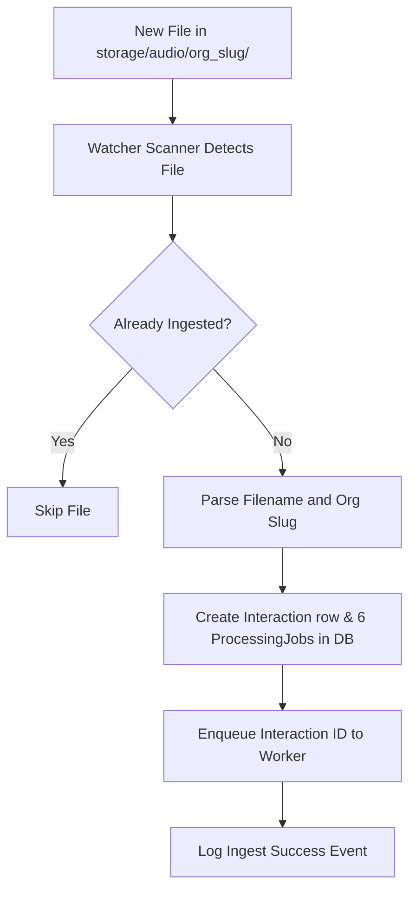

# Audio Auto-Ingest Watcher Service

VocalMind provides an automated background folder watcher to ingest call recordings without requiring manual manager dashboard uploads.

---

## 1. Watcher Mechanics

*   **Implementation File**: `backend/app/core/audio_folder_watcher.py`
*   **Trigger Interval**: Automatically initializes during backend startup lifespan and loops every 15 seconds.
*   **Watch Directory**: Scans the path `storage/audio/{org_slug}/` for audio files.
*   **Supported File Types**: `.wav` and `.mp3`.

---

## 2. Filename Convention & Assignment

The watcher extracts metadata from filenames to automatically assign the interaction to the correct agent:

*   **Expected Pattern**: `CALL_<NN>_<agent>_<scenario>.<ext>`
    *   Example: `CALL_03_priya_billing_issue.wav`
*   **Assignment Logic**:
    *   The watcher extracts the `agent` name token from the filename.
    *   It checks the organization's user database to find a matching agent account.
    *   If matched, the interaction is created with `agent_id` set to that user.
*   **Fallback Logic**: If the filename does not conform to the pattern or the agent name cannot be resolved, the interaction is still ingested. It is assigned to a deterministic fallback agent and a warning is logged in the backend.

---

## 3. Ingest Lifecycle

When a new file is discovered:

---

## 4. Watcher Controls

*   **Enable/Disable Switch**: In `backend/.env`, set `AUDIO_FOLDER_WATCHER_ENABLED=false` to turn off the scanner.
*   **`EXTRA_AUDIO_ROOTS`**: If you run the backend natively from a separate directory while call audio lives in a sibling workspace, set `EXTRA_AUDIO_ROOTS` (semicolon-separated absolute paths) in your environment to add search roots.
*   **Manual Alternative**: If the watcher is disabled, managers can upload call recordings using the **Upload Call** button in the dashboard, which triggers `POST /api/v1/interactions`.
